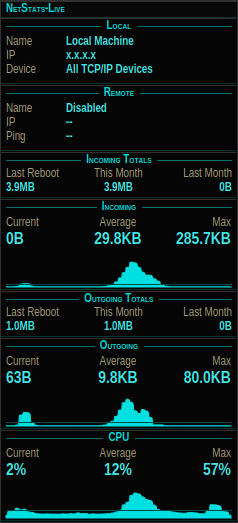

# NetStats-Live for Linux

[](https://github.com/DeviousVon/NetStats-Live/actions/workflows/ci.yml)

NetStats-Live for Linux (`netstats-live`) is a small Qt6 desktop network monitor inspired by AnalogX NetStat Live. It shows local/remote network status, live incoming/outgoing throughput graphs, session totals, monthly totals, thread count, CPU use, and a traffic-aware tray icon.

This is a clean-room reimplementation for Linux. AnalogX NetStat Live is credited as the inspiration; this project does not reuse AnalogX code or original assets.



## Status

`v0.1.0-alpha` is the first public alpha. It is usable on the primary target environment, but not yet broadly validated across every Linux desktop shell.

## Features

- C++20, Qt6 Widgets, CMake, no QML.
- Custom-painted frameless dark vertical panel using `QPainter`.
- Panes for Local Machine, Remote Machine, Incoming/Outgoing Totals, Incoming/Outgoing graphs, Threads, and CPU.
- Linux `/proc/net/dev`, `/proc/stat`, and `/proc/loadavg` collection on a 500 ms timer.
- Async `ping -c 1` rolling average and async `traceroute -n -m 30 -q 1` hop count when those tools are installed.
- Runtime-painted `QSystemTrayIcon` / StatusNotifierItem with cached TX/RX flash states and traffic-age indicator.
- Right-click context menu with pane toggles, config toggles, interface selection, reset, minimize, and exit.
- URL ClipCap support through Qt clipboard notifications plus a KDE Klipper DBus fallback.
- QSettings INI persistence at `~/.config/netstats-live/netstats-live.conf`.
- One-time settings migration copies `~/.config/nsl-linux/nsl-linux.conf` to the new path if the new config file does not already exist.
- Monthly transfer total archiving with calendar-month rollover.
- Auto Start, Auto Minimize, single-instance activation over DBus, and optional KDE Wayland layer-shell support.

## Install from a Debian package

Download one of the release `.deb` files from the GitHub release page:

- `NetStats-Live_0.1.0_kde_amd64.deb` — KDE/Wayland-focused build with layer-shell support when available.
- `NetStats-Live_0.1.0_generic_amd64.deb` — generic Qt6 build without a layer-shell dependency.

Install with:

```bash
sudo apt install ./NetStats-Live_0.1.0_generic_amd64.deb
```

or, on KDE Plasma Wayland:

```bash
sudo apt install ./NetStats-Live_0.1.0_kde_amd64.deb
```

The package installs:

- `/usr/bin/netstats-live`
- `/usr/share/applications/netstats-live.desktop`
- `/usr/share/icons/hicolor/{64x64,128x128,256x256}/apps/netstats-live.png`

Runtime notes:

- `iputils-ping` and `traceroute` are recommended for Remote Machine ping/hop fields.
- Debian packages currently target Ubuntu/Kubuntu 24.04+ style Qt6 dependency versions on `amd64`.

## Build from source

Install dependencies on Ubuntu/Kubuntu 24.04+:

```bash
sudo apt update
sudo apt install -y \
  build-essential cmake \
  qt6-base-dev qmake6 qmake6-bin \
  libqt6dbus6 libqt6network6 libqt6widgets6 \
  iputils-ping traceroute
```

For the KDE/Wayland layer-shell build, also install:

```bash
sudo apt install -y liblayershellqtinterface-dev
```

Build and test:

```bash
cmake -S . -B build -DCMAKE_BUILD_TYPE=Release
cmake --build build -j"$(nproc)"
ctest --test-dir build --output-on-failure
```

Run:

```bash
./build/netstats-live
```

Start hidden in the tray when a tray is available:

```bash
./build/netstats-live --minimized
```

If no tray/status-notifier host is available, the app ignores `--minimized` and Auto Minimize and starts visible so it cannot become unreachable.

## Build package artifacts

KDE/Wayland package:

```bash
cmake -S . -B build-kde -DCMAKE_BUILD_TYPE=Release -DUSE_LAYER_SHELL=ON
cmake --build build-kde -j"$(nproc)"
cpack --config build-kde/CPackConfig.cmake -G DEB
```

Generic package:

```bash
cmake -S . -B build-generic -DCMAKE_BUILD_TYPE=Release -DUSE_LAYER_SHELL=OFF
cmake --build build-generic -j"$(nproc)"
cpack --config build-generic/CPackConfig.cmake -G DEB
```

Dry-run install check:

```bash
dpkg --dry-run -i outputs/final/NetStats-Live_0.1.0_kde_amd64.deb
dpkg --dry-run -i outputs/final/NetStats-Live_0.1.0_generic_amd64.deb
```

## Compatibility

| Environment | Current status |
| --- | --- |
| KDE Plasma Wayland | Fully supported primary target. Use the KDE package for the strongest always-on-top behavior through layer-shell. |
| KDE Plasma X11 | Expected to work; not yet fully release-validated. |
| Cinnamon X11 | Expected to work; not yet fully release-validated. Tray and normal window-manager keep-above hints should work on typical setups. |
| XFCE X11 | Expected to work; not yet fully release-validated. Tray and normal window-manager keep-above hints should work on typical setups. |
| GNOME Wayland | Limited. GNOME usually needs an AppIndicator/KStatusNotifier extension for tray access. Always-on-top and ClipCap are degraded. |
| GNOME X11 | Limited. Main window should run, but tray support still generally needs an extension. |
| Other Wayland compositors | Unverified. Tray, keep-above, and clipboard behavior vary by compositor. |

## Known limitations vs. original NetStat Live

- Linux-only; no Windows support.
- No original AnalogX code, icons, or assets are included.
- Remote Machine metrics use local `ping` and `traceroute`; fields degrade when those tools are unavailable or blocked by the network.
- URL ClipCap is best on KDE because KDE Klipper exposes a DBus fallback. GNOME Wayland and other compositors may restrict background clipboard reads.
- Always-on-top is compositor-dependent. KDE Wayland with the KDE package is the best-supported path; generic builds use Qt/window-manager hints.
- Cross-desktop validation is still alpha-level. KDE Plasma Wayland is the only fully supported desktop for `v0.1.0-alpha`.

## KDE / Wayland notes

- The main window is frameless and draggable from the background using `QWindow::startSystemMove()`.
- `QSystemTrayIcon` maps to KDE Plasma's StatusNotifierItem support.
- Single-instance activation uses DBus. Launching `netstats-live` again activates the existing window and exits.
- SIGTERM/SIGINT are bridged into the Qt event loop so totals/config are saved before exit. A hard crash/SIGKILL can lose at most the last 60 seconds because totals are flushed once per minute.
- Always on Top changes are applied by a live hide/show cycle because Qt/Wayland window flags and layer-shell state need the surface to be recreated. This may briefly flicker but does not require a process restart.
- Background clipboard access is Wayland-restricted. URL ClipCap uses normal Qt clipboard notifications when available and polls Klipper over DBus (`org.kde.klipper`, `/klipper`, `getClipboardContents`) every 2 seconds as a KDE fallback.

### KWin “Keep above” window rule

If Always on Top is not honored on KDE Wayland and the binary was built without layer-shell support:

1. Open **System Settings**.
2. Go to **Window Management → Window Rules**.
3. Click **Add New**.
4. Match window class / resource class exactly:

   ```text
   netstats-live
   ```

5. Add property **Keep above other windows**.
6. Set it to **Force → Yes** or **Apply Initially → Yes**.
7. Save/apply the rule and restart NetStats-Live.

You can also open the rules module directly with:

```bash
kcmshell6 kwinrules
```

## Tests

CTest currently covers:

- NetStat-style units and bits/bytes conversion.
- `/proc/net/dev` parsing and ALL-interface summing excluding `lo`.
- Counter-reset delta handling.
- `/proc/stat` CPU delta percent.
- `/proc/loadavg` thread total parsing.
- traceroute hop parsing.
- Tray activity bucket transitions and tray icon visual states.
- Tray renderer cache behavior.
- Tray icon legibility at 22x22 and 16x16 through pixel-marker checks.
- StatusNotifierItem activation mapping.
- `NSL_FAKE_DATE` month rollover, monthly history archiving, and displayed Last Month totals.
- Auto Start desktop-file creation/removal.
- Trayless desktop startup/minimize safety.
- Single-instance DBus service/path constants.

Run:

```bash
ctest --test-dir build --output-on-failure
```

## Project layout

```text
src/main.cpp              application entry point, DBus single-instance, signal handling
src/MainWindow.*          main widget, panes, menus, tray integration
src/Collector.*           Linux metric collection and remote ping/traceroute probes
src/Settings.*            settings, autostart file, monthly total persistence
src/ClipCap.*             clipboard URL capture and KDE Klipper fallback
src/Core.*                parsing and formatting helpers
tests/                    CTest unit/regression tests
config/netstats-live.desktop  desktop launcher
assets/icons/             installed application icons
docs/                     public docs, screenshot, and development history
```

## License

NetStats-Live for Linux is licensed GPLv3 — free to use, modify, and redistribute, provided derivative works are also released under GPLv3. See [LICENSE](LICENSE) for the full GNU General Public License v3.0 text.
