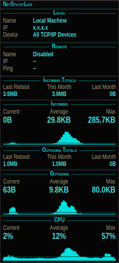

# NetStats-Live for Linux

[](https://github.com/DeviousVon/NetStats-Live/actions/workflows/ci.yml)

NetStats-Live for Linux (`netstats-live`) is a small Qt6 desktop network monitor inspired by AnalogX NetStat Live. It shows local/remote network status, live incoming/outgoing throughput graphs, session totals, monthly totals, thread count, CPU use, and a traffic-aware tray icon.

This is a clean-room reimplementation for Linux. AnalogX NetStat Live is credited as the inspiration; this project does not reuse AnalogX code or original assets.



## Status

`v0.1.0-alpha` is the current public release. The private canonical branch is
preparing an unreleased `0.2.0` candidate with hardened persistence,
single-instance authority, accessibility, and multi-distribution packaging.
No `0.2.0` tag or public release exists until the final release gate is approved.

**Download:** get the Debian packages from the [v0.1.0-alpha release page](https://github.com/DeviousVon/NetStats-Live/releases/tag/v0.1.0-alpha).

## Features

- C++20, Qt6 Widgets, CMake, no QML.
- Custom-painted frameless dark vertical panel using `QPainter`.
- Panes for Local Machine, Remote Machine, Incoming/Outgoing Totals, Incoming/Outgoing graphs, Threads, and CPU.
- Linux `/proc/net/dev`, `/proc/stat`, and `/proc/loadavg` collection on a 500 ms timer.
- Async `ping -c 1` rolling average and async `traceroute -n -m 30 -q 1` hop count when those tools are installed.
- Runtime-painted `QSystemTrayIcon` / StatusNotifierItem with cached TX/RX flash states and traffic-age indicator.
- Pointer and keyboard context menu with pane toggles, config toggles, interface selection, reset, minimize, and exit.
- Keyboard-focusable and assistive-technology-accessible title/minimize controls.
- URL ClipCap support through Qt clipboard notifications plus an asynchronous, timeout-bounded KDE Klipper DBus fallback.
- QSettings INI persistence at `~/.config/netstats-live/netstats-live.conf`.
- One-time settings migration copies `~/.config/nsl-linux/nsl-linux.conf` to the new path if the new config file does not already exist.
- Monthly transfer total archiving with calendar-month rollover.
- Auto Start, Auto Minimize, single-instance activation over DBus, and optional KDE Wayland layer-shell support.

## Install a release artifact

After `0.2.0` is approved and released, download an artifact from
the [GitHub releases page](https://github.com/DeviousVon/NetStats-Live/releases):

- `NetStats-Live_0.2.0_generic_amd64.deb` — Debian/Ubuntu package.
- `NetStats-Live_0.2.0_generic_x86_64.rpm` — Fedora/RPM package.
- `NetStats-Live-0.2.0-x86_64.AppImage` — portable x86-64 build.

Install the DEB with:

```bash
sudo apt install ./NetStats-Live_0.2.0_generic_amd64.deb
```

Install the RPM with:

```bash
sudo dnf install ./NetStats-Live_0.2.0_generic_x86_64.rpm
```

Run the AppImage without installing it:

```bash
chmod +x NetStats-Live-0.2.0-x86_64.AppImage
./NetStats-Live-0.2.0-x86_64.AppImage
```

The DEB and RPM install:

- `/usr/bin/netstats-live`
- `/usr/share/applications/netstats-live.desktop`
- `/usr/share/icons/hicolor/{64x64,128x128,256x256}/apps/netstats-live.png`
- `/usr/share/metainfo/io.github.deviousvon.netstats-live.metainfo.xml`
- `/usr/share/doc/netstats-live/{copyright,NEWS.gz,changelog.gz}`
- `/usr/share/man/man1/netstats-live.1.gz`

Runtime notes:

- `iputils-ping` and `traceroute` are recommended for Remote Machine ping/hop fields.
- The published DEB is built for Ubuntu 24.04+ compatible `t64` Qt 6 runtimes;
  its dependencies are generated from and validated against the packaged binary.
- Source builds are separately validated on Ubuntu 22.04, Ubuntu 24.04, Debian
  12, and a genuine Qt 6 KDE build baseline.

## Build from source

Install generic-build dependencies on Ubuntu 22.04 or later:

```bash
sudo apt update
sudo apt install -y \
  build-essential cmake \
  qt6-base-dev qmake6 qmake6-bin \
  libgl-dev libopengl-dev \
  iputils-ping traceroute
```

For a KDE/Wayland build, use a distribution that provides **Qt 6**
LayerShellQt and/or KF6 WindowSystem, then install the available development
packages:

```bash
sudo apt install -y liblayershellqtinterface-dev libkf6windowsystem-dev
```

Ubuntu 22.04 and Ubuntu 24.04 package `liblayershellqtinterface-dev` for Qt 5;
NetStats-Live rejects that ABI and produces a generic package instead. The
build script fails rather than labeling such a fallback as KDE.

Build and test:

```bash
cmake -S . -B build -DCMAKE_BUILD_TYPE=Release
cmake --build build -j"$(nproc)"
ctest --test-dir build --output-on-failure
```

CTest covers core parsing/formatting, tray rendering, visual-theme guardrails, settings/lifecycle and migration behavior, plus the real `MainWindow` minimize/restore, position, title-control, DBus-slot compatibility, and activation-token cleanup paths.

Run:

```bash
./build/netstats-live
```

Start hidden in the tray when a tray is available:

```bash
./build/netstats-live --minimized
```

If no tray/status-notifier host is available, the app ignores `--minimized` and Auto Minimize and starts visible so it cannot become unreachable.

## Build and verify package artifacts

Use the repository-owned package gate. It uses fresh bounded output trees,
runs CTest, generates shared-library dependencies, validates exact package
contents and metadata, rejects Qt 5/private paths/RPATH, dry-runs installation,
and can prove byte-for-byte reproducibility:

```bash
scripts/build-debs.sh --flavor generic --reproducible
scripts/build-debs.sh --flavor kde --reproducible
```

The KDE command fails closed unless a genuine Qt 6 LayerShellQt or KF6
WindowSystem integration is enabled. Packages are written under
`outputs/release/packages/` and remain ignored by Git.

## Compatibility

| Environment | Current status |
| --- | --- |
| KDE Plasma Wayland | Verified with the generic DEB: rendering, StatusNotifierItem registration, and tray minimize/restore. Optional genuine Qt 6 KDE integration remains the best path for compositor-level keep-above behavior. |
| KDE Plasma X11 | Unverified for this candidate; no production support claim. |
| Cinnamon X11 | Verified with the AppImage: rendering, status icon, and physical tray menu. |
| XFCE X11 | Verified with the generic DEB: rendering, XEmbed tray fallback, and physical tray menu. |
| GNOME Wayland | Verified on Ubuntu and Fedora with an AppIndicator/KStatusNotifier extension. Without a tray host, the app restores or remains visible so it cannot become unreachable. |
| GNOME X11 | Unverified and expected to need a tray extension; no production support claim. |
| Other Wayland compositors | Unverified; tray, keep-above, and clipboard behavior vary by compositor. |

## Known limitations vs. original NetStat Live

- Linux-only; no Windows support.
- No original AnalogX code, icons, or assets are included.
- Remote Machine metrics use local `ping` and `traceroute`; fields degrade when those tools are unavailable or blocked by the network.
- URL ClipCap is best on KDE because KDE Klipper exposes a DBus fallback. GNOME Wayland and other compositors may restrict background clipboard reads.
- Always-on-top is compositor-dependent. KDE Wayland with the KDE package is the best-supported path; generic builds use Qt/window-manager hints.
- The verified matrix above covers Ubuntu GNOME Wayland, Fedora GNOME Wayland,
  KDE Plasma Wayland, Cinnamon X11, and XFCE X11. Other rows remain explicitly
  unverified until live evidence exists.

## KDE / Wayland notes

- The main window is frameless and draggable from the background using `QWindow::startSystemMove()`.
- `QSystemTrayIcon` maps to KDE Plasma's StatusNotifierItem support.
- KDE builds with KF6 WindowSystem restore a minimized window without remapping its Wayland surface, preserving its compositor position. Generic builds fall back to remapping when Qt and the compositor disagree about minimized state.
- Single-instance activation uses DBus. Launching `netstats-live` again forwards its xdg activation token, activates the existing window, and exits; tokenless CLI launches use the remap fallback when necessary.
- SIGTERM/SIGINT are bridged into the Qt event loop so totals/config are saved before exit. A hard crash/SIGKILL can lose at most the last 60 seconds because totals are flushed once per minute.
- Always on Top changes destroy the prior shell authority and recreate the native surface. Turning it off creates a normal xdg-toplevel; turning it on creates a fresh layer surface. This may briefly flicker but does not require a process restart.
- Background clipboard access is Wayland-restricted. URL ClipCap uses normal Qt clipboard notifications when available and polls Klipper over DBus (`org.kde.klipper`, `/klipper`, `getClipboardContents`) every 2 seconds as a KDE fallback.

### KWin “Keep above” window rule

If Always on Top is not honored on KDE Wayland and the binary was built without layer-shell support:

1. Open **System Settings**.
2. Go to **Window Management → Window Rules**.
3. Click **Add New**.
4. Match window class / resource class exactly:

   ```text
   netstats-live
   ```

5. Add property **Keep above other windows**.
6. Set it to **Force → Yes** or **Apply Initially → Yes**.
7. Save/apply the rule and restart NetStats-Live.

You can also open the rules module directly with:

```bash
kcmshell6 kwinrules
```

## Tests

CTest currently covers:

- NetStat-style units and bits/bytes conversion.
- `/proc/net/dev` parsing and ALL-interface summing excluding `lo`.
- Counter-reset delta handling.
- `/proc/stat` CPU delta percent.
- `/proc/loadavg` thread total parsing.
- traceroute hop parsing.
- Tray activity bucket transitions and tray icon visual states.
- Tray renderer cache behavior.
- Tray icon legibility at 22x22 and 16x16 through pixel-marker checks.
- StatusNotifierItem activation mapping.
- `NSL_FAKE_DATE` month rollover, monthly history archiving, and displayed Last Month totals.
- Auto Start desktop-file creation/removal.
- Trayless desktop startup/minimize safety.
- Single-instance DBus service/path constants.
- Profile-specific lock/DBus authority, stale-lock recovery, and second-launch activation.
- Truthful settings/totals/autostart failure propagation and adversarial path-substitution rollback.
- Asynchronous one-request-in-flight Klipper fallback with deadline and stale-reply handling.
- Keyboard context-menu/minimize behavior, accessible roles/names/actions, focus restoration, and layer-shell authority transitions.

Run:

```bash
ctest --test-dir build --output-on-failure
```

## Project layout

```text
src/main.cpp              application entry point, DBus single-instance, signal handling
src/MainWindow.*          main widget, panes, menus, tray integration
src/Collector.*           Linux metric collection and remote ping/traceroute probes
src/Settings.*            settings, autostart file, monthly total persistence
src/ClipCap.*             clipboard URL capture and KDE Klipper fallback
src/Core.*                parsing and formatting helpers
tests/                    CTest unit/regression tests
config/netstats-live.desktop  desktop launcher
config/netstats-live.metainfo.xml  AppStream metadata
assets/icons/             installed application icons
scripts/build-debs.sh     deterministic DEB build and verification gate
docs/                     public docs, screenshot, and development history
```

## Security

Report suspected vulnerabilities privately as described in
[SECURITY.md](SECURITY.md). Do not put exploit details, credentials, or affected
user data in public issues.

## License

NetStats-Live for Linux is licensed GPLv3 — free to use, modify, and redistribute, provided derivative works are also released under GPLv3. See [LICENSE](LICENSE) for the full GNU General Public License v3.0 text.
